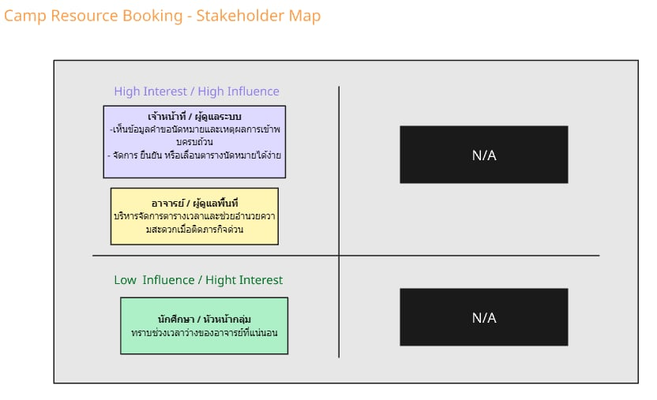

# 02 — Stakeholder, System Context and Scope

> **Week 2 deliverable**  
> เวอร์ชัน: v0.1 | สถานะ: Draft | วันที่ปรับปรุง: [DD/MM/YYYY]

## 1. Problem Frame (revised)

### 1.1 สถานการณ์ปัจจุบัน
นักศึกษาที่ต้องการนัดหมายเข้าพบอาจารย์ที่ปรึกษาเพื่อปรึกษาเรื่องเรียนหรือโครงงาน ต้องสุ่มเดินไปหาอาจารย์ที่ห้องพัก สอบถามผ่านกลุ่ม LINE ส่วนตัว หรือติดต่อผ่านเจ้าหน้าที่ภาควิชาโดยตรง ทำให้ไม่ทราบตารางเวลาว่างที่แน่ชัดของอาจารย์ ส่งผลให้ข้อมูลตารางนัดหมายไม่เป็นปัจจุบัน (Real-time) เกิดการนัดวันเวลาซ้อนทับกัน และนักศึกษาบ่อยครั้งต้องเดินทางมาเก้อโดยไม่พบอาจารย์

### 1.2 ใครได้รับผลกระทบ
* **นักศึกษา / ผู้ขอเข้าพบ:** เสียเวลาในการติดต่อสอบถามหลายช่องทาง และเดินทางมาคณะแล้วไม่เจออาจารย์ที่ปรึกษาเนื่องจากเวลาไม่ตรงกัน
* **อาจารย์ที่ปรึกษา:** ต้องคอยตอบคำถามเดิมซ้ำ ๆ เกี่ยวกับเวลาว่าง จัดการตารางนัดหมายคลาดเคลื่อน และถูกรบกวนเวลานอกเวลางาน
* **เจ้าหน้าที่ภาควิชา:** มีภาระงานเอกสารและการประสานงานจัดตารางนัดหมายด้วยมือ (Manual) ที่ซ้ำซ้อน

### 1.3 Problem Statement
กระบวนการนัดหมายและจัดตารางเวลาเข้าพบอาจารย์ที่ปรึกษายังไม่มีระบบหน้าเว็บไซต์กลางในการประสานงานที่มีประสิทธิภาพ ทำให้ตารางเวลาไม่เป็นปัจจุบัน เกิดความล่าช้าในการสื่อสาร ภาระงานของอาจารย์และเจ้าหน้าที่สูง และนักศึกษาไม่ทราบสถานะคำขอนัดหมายที่ชัดเจน

---
### 1.4 ผลลัพธ์ที่ต้องการ (โดยยังไม่กำหนด solution)
* นักศึกษาเห็นข้อมูลตารางเวลาว่างและช่วงเวลาเข้าพบของอาจารย์ที่ปรึกษาที่น่าเชื่อถือ
* อาจารย์ที่ปรึกษาสามารถจัดการคำขอนัดหมาย ตรวจสอบเหตุผล และติดตามสถานะได้เป็นระบบ
* ผู้บริหารคณะ/ภาควิชามองเห็นข้อมูลสถิติการเข้าพบ และปัญหาเชิงภาพรวมของนักศึกษาในสังกัด
* กฎการนัดหมาย การอนุมัติ และการขอเลื่อนวันเวลามีความโปร่งใส ตรวจสอบได้

### 1.5 สิ่งที่ทีมยังต้องเรียนรู้
* คำขอประเภทใดที่ต้องให้อาจารย์กดอนุมัติด้วยตนเอง และมีกรณีใดบ้างที่ระบบสามารถยืนยันนัดอัตโนมัติ
* กำหนดการนัดหมายล่วงหน้า (จองก่อนกี่วัน) ระยะเวลาในการเข้าพบต่อคน และกติกาการยกเลิกนัดคืออะไร

## 2. Stakeholder Map

Source: [Miro Board](https://miro.com/app/board/uXjVH8fhOmU=/)

| Stakeholder / External System | Role / Current work | Needs / Goals | Influence | Interest | Why it matters |
|---|---|---|---|---|---|
| นักศึกษา / หัวหน้ากลุ่ม |  นัดหมายอาจารย์ที่ปรึกษา | ทราบช่วงเวลาว่างของอาจารย์ที่แน่นอน | ปานกลาง | สูง | เป็นผู้ใช้หลักตารางเวลาว่างและเป็นคนนัดช่วงเวลาเข้าพบของอาจารย์ที่ปรึกษา |
| เจ้าหน้าที่ / ผู้ดูแลระบบ | ตรวจคำขออนุมัติ แก้ไข และอัปเดตสถานะการดำเนินงาน | -เห็นข้อมูลคำขอนัดหมายและเหตุผลการเข้าพบครบถ้วน - จัดการ ยืนยัน หรือเลื่อนตารางนัดหมายได้ง่าย | สูง | สูง | เป็นผู้ปฏิบัติงานหลักและเกี่ยวกับขั้นตอนการนัดหมายอาจารย์ และแก้ไขปัญหาจริง |
| อาจารย์ / ผู้ดูแลพื้นที่  | รับข้อมูลนัดหมายและแจ้งตารางเวลาว่าง หรือธุระด่วน | บริหารจัดการตารางเวลาและช่วยอำนวยความสะดวกเมื่อติดภารกิจด่วน | สูง | สูง | เพื่อบอกช่วงเวลาในการนัดหมายได้ถูกต้อง |

### 2.1 Stakeholder Profiles

**Stakeholder: นักศึกษา / ผู้ขอเข้าพบ**
* **Goal / need:** ค้นหาเวลาว่างของอาจารย์ที่ปรึกษา ส่งคำขอนัดหมายได้รวดเร็ว และทราบผลการพิจารณาได้ทันทีโดยไม่ต้องเดินไปถามซ้ำ
* **Pain point:** เวลาว่างไม่ตรงกับอาจารย์ ตารางนัดหมายซ้อนทับกัน และไม่แน่ใจว่าอาจารย์จะสะดวกให้เข้าพบจริงหรือไม่
* **Concern / risk:** กลัวคลาดเคลื่อนเวลานัดจนส่งงาน/ส่งเล่มโครงงานไม่ทันกำหนด เพราะไม่มีการยืนยันสถานะที่ชัดเจน
* **Information this stakeholder knows:** ช่วงเวลาและหัวข้อที่ต้องการเข้าพบ รูปแบบการติดต่อปัจจุบัน และปัญหาจากการนัดซ้อน
* **Influence / decision power:** Medium — เป็นกลุ่มผู้ใช้งานหลักหน้าเว็บไซต์ แต่ไม่มีอำนาจในการกำหนดกฎหรือเกณฑ์การอนุมัติ
* **Open questions for Week 3:** นักศึกษาจำเป็นต้องส่งเอกสารหรือไฟล์สรุปประเด็นก่อนเข้าพบล่วงหน้าผ่านระบบด้วยหรือไม่?

**Stakeholder: อาจารย์ที่ปรึกษา**
* **Goal / need:** จัดการตารางเวลาว่างของตัวเองได้อย่างมีประสิทธิภาพ ตรวจสอบและอนุมัติคำขอนัดหมายผ่านหน้าเว็บได้ง่ายในที่เดียว
* **Pain point:** ถูกรบกวนนอกเวลางาน ได้รับคำถามซ้ำ ๆ เรื่องเวลาว่าง และตารางเข้าพบคลาดเคลื่อนบ่อยครั้งจากระบบประสานงานเดิม
* **Concern / risk:** นักศึกษาไม่มาตามนัด (No-show) หรือมีจำนวนนักศึกษาขอเข้าพบหนาแน่นเกินไปในช่วงสัปดาห์สอบ/ส่งเล่ม
* **Information this stakeholder knows:** ตารางภาระงานของตนเอง ขั้นตอนการให้คำปรึกษา และเงื่อนไข/เหตุผลที่คำขอบางรายการจะถูกปฏิเสธ
* **Influence / decision power:** High — เป็นผู้ดำเนินงานหลักและมีสิทธิ์ขาดในการกดอนุมัติ ปฏิเสธ หรือขอเลื่อนนัดหมาย
* **Open questions for Week 3:** อาจารย์ต้องการกำหนดโควตานักศึกษาเข้าพบสูงสุดกี่คนต่อหนึ่งช่วงเวลา?

**Stakeholder: เจ้าหน้าที่ภาควิชา / ผู้ดูแลระบบ**
* **Goal / need:** ลดภาระงานเอกสารและการประสานงานตารางนัดหมายด้วยมือ (Manual) สามารถตรวจสอบภาพรวมการเข้าพบได้สะดวก
* **Pain point:** ต้องคอยตอบคำถามแทนนศ.และอาจารย์ ข้อมูลตารางจัดเก็บกระจัดกระจายหลายไฟล์ และตรวจสอบกฎเกณฑ์ได้ยาก
* **Concern / risk:** ข้อมูลการนัดหมายไม่ซิงค์กันระหว่างภาควิชา เกิดปัญหาเมื่ออาจารย์ติดภารกิจด่วนของคณะ
* **Information this stakeholder knows:** รายชื่อนิสิตนักศึกษาและรายชื่ออาจารย์ที่ปรึกษาที่จับคู่กันในสังกัด กฎระเบียบและแนวปฏิบัติของคณะ
* **Influence / decision power:** High — เป็นผู้จัดการระบบคอยแก้ไขข้อมูลพื้นฐานและสิทธิ์การใช้งานของนักศึกษาและอาจารย์
* **Open questions for Week 3:** หากมีการเปลี่ยนตัวอาจารย์ที่ปรึกษาระหว่างภาคการศึกษา ระบบต้องรองรับการโยกย้ายข้อมูลอย่างไร?

**Stakeholder: ผู้ดูแลระบบ IT (IT Admin)**
* **Goal / need:** ระบบใช้บัญชีสถาบันในการยืนยันตัวตน มีการแยกสิทธิ์ตามบทบาทชัดเจน และไม่มีการเก็บข้อมูลเกินความจำเป็น
* **Pain point:** ระบบใหม่อาจขอข้อมูลสิทธิ์ของนักศึกษามากเกินไป หรือทำให้เกิดภาระในการดูแลระบบฐานข้อมูลแยกส่วน
* **Concern / risk:** ข้อมูลเหตุผลการเข้าพบซึ่งอาจเป็นความลับส่วนบุคคลรั่วไหล หรือการเชื่อมต่อระบบล็อกอินมหาลัยทำไม่ได้
* **Information this stakeholder knows:** ข้อจำกัดด้านระบบยืนยันตัวตน (Identity), Access control และ Security baseline ของสถาบัน

### 3.1 System Boundary
ขอบเขตของระบบนัดหมายเข้าพบอาจารย์ที่ปรึกษา ครอบคลุมการค้นหาและแสดงตารางเวลาว่างของอาจารย์, การส่งคำขอนัดหมาย, การตรวจสอบและอนุมัติ/ปฏิเสธ/ขอเลื่อนนัดหมายโดยอาจารย์, การแจ้งเตือนสถานะคำขอ และการบันทึกประวัติการเข้าพบในระดับที่กำหนด 

**ระบบนี้ ไม่ใช่:** ระบบจัดการเรียนการสอน (LMS), ระบบลงทะเบียนเรียนของมหาวิทยาลัย, หรือระบบห้องประชุมออนไลน์ (เช่น Zoom/Teams)

### 3.2 Key Data Flows

| From → To | Data / Request | Why it matters |
| :--- | :--- | :--- |
| **นักศึกษา → ระบบ** | คำขอนัดหมาย ยืนยันวันเวลา เหตุผล หรือยกเลิกคำขอ | เป็นจุดเริ่ม workflow ของผู้ใช้หลัก |
| **ระบบ → นักศึกษา** | ตารางเวลาว่างของอาจารย์ สถานะคำขอ และการแจ้งเตือนผล | ลดความไม่แน่นอนและการเดินไปหาแล้วไม่เจอตัว |
| **อาจารย์ → ระบบ** | อนุมัติ ปฏิเสธ ขอเลื่อนนัด และการตั้งค่าช่วงเวลาว่าง (Availability) | แสดงงานปฏิบัติจริงที่ต้องรองรับจากฝั่งอาจารย์ |
| **ระบบ → อาจารย์** | รายการคำขอนัดหมาย งานค้างอนุมัติ และสรุปตารางนัดหมายประจำวัน | ช่วยลดงานประสานงานและการตอบแชทซ้ำ ๆ ของอาจารย์ |
| **เจ้าหน้าที่/ผู้ดูแล → ระบบ** | ข้อมูลการจับคู่นักศึกษา-อาจารย์ที่ปรึกษา และรายงานสถิติภาพรวม | ทำให้ requirement เชื่อมกับเป้าหมายระดับหน่วยงาน/ภาควิชา |
| **ระบบ ↔ Identity Service** | คำขอตรวจสอบบัญชีสถาบันและบทบาท (Role) ของผู้ใช้งาน | ลดการสร้างบัญชีใหม่บนเว็บ และรองรับ access control |
| **ระบบ → Notification Service** | ข้อมูลแจ้งเตือนสถานะคำขอ หรือเตือนความจำเวลานัดหมาย | ทำให้ผู้ใช้ทราบสถานะอัปเดตตามเวลาที่เหมาะสม (LINE/Email) |
| **ระบบ ↔ ฐานข้อมูลทะเบียนเดิม** | ข้อมูลรายชื่อและสังกัดของนักศึกษาพร้อมอาจารย์ที่ปรึกษา | ลดความคลาดเคลื่อนระหว่างข้อมูลนักศึกษากับอาจารย์จริง |

## 4. Scope Statement

### In Scope
1. ค้นหาสถานะและตารางเวลาว่างของอาจารย์ที่ปรึกษาในภาควิชา
2. ส่งคำขอนัดหมายพร้อมระบุวัตถุประสงค์ (เช่น ปรึกษาโปรเจกต์, ลงทะเบียน) และระบุรายชื่อผู้เข้าพบ
3. ระบบรองรับคำขอนัดหมายแบบรายบุคคลและแบบกลุ่ม
4. อาจารย์พิจารณา จัดการคำขอ (อนุมัติ / ปฏิเสธ / เลื่อนนัด)
5. ระบบอัปเดตและแจ้งเตือนผลสถานะการนัดหมายแก่ผู้ใช้

### Out of Scope
1. ระบบลาเรียน หรือลาป่วยอย่างเป็นทางการของภาควิชา
2. การจองคิวหรือนัดหมายอาจารย์ข้ามคณะ
3. การเชื่อมโยงกับระบบทะเบียนหลักของมหาวิทยาลัยที่มีความซับซ้อนสูง

### Constraints
* เป็นโครงงานเพื่อการเรียนรู้ภายใน 1 ภาคการศึกษา
* ไม่ใช้ข้อมูลส่วนบุคคลจริงหรือเชื่อมต่อระบบเครือข่ายฐานข้อมูลของมหาวิทยาลัยจริงในระยะเรียน
* ข้อมูลตารางสอน ภาระงาน หรือรายชื่อการจับคู่อาจารย์ที่ปรึกษาเดิมอาจไม่ครบถ้วนหรือไม่เป็นระบบระเบียบ
* ทีมมีสมาชิกจำกัดและมีเวลาพัฒนา/ออกแบบจำกัดในภาคการศึกษานี้

### Assumptions
* อาจารย์ที่ปรึกษามีการอัปเดตและระบุตารางเวลาว่างของตนเองบนหน้าเว็บไซต์อย่างสม่ำเสมอ
* ผู้ใช้งานทุกคนสามารถยืนยันตัวตนด้วยบัญชีสถาบันเพื่อเข้าใช้งานหน้าเว็บไซต์ได้
* มีเจ้าหน้าที่ภาควิชาหรือระบบส่วนกลางคอยจัดการข้อมูลพื้นฐานและการจับคู่นักศึกษากับอาจารย์ในระบบ
* หน่วยงานยอมรับการใช้ระบบแจ้งเตือนสถานะการนัดหมายผ่านทางอีเมลหรือช่องทาง LINE Notify จำลองในโครงงาน

### Open Questions

| ID | Open Question | Why it matters | Priority | ส่งต่อ Week 03 อย่างไร |
| :--- | :--- | :--- | :--- | :--- |
| **OQ-01** | คำขอนัดหมายประเภทใดต้องผ่านการอนุมัติมือ และใครมีสิทธิ์อนุมัติแทนกรณีอาจารย์ติดภารกิจด่วน? | กำหนด workflow และ role ของระบบ | High | สัมภาษณ์เจ้าหน้าที่ภาควิชา + วิเคราะห์กฎ/เอกสาร |
| **OQ-02** | นักศึกษาสามารถส่งคำขอนัดหมายล่วงหน้าได้กี่วัน และจองเวลาคุยได้นานที่สุดเท่าใดต่อครั้ง? | กำหนด validation rule | High | สัมภาษณ์อาจารย์ผู้สอน + เอกสารนโยบาย |
| **OQ-03** | หากนักศึกษายกเลิกนัดกระชั้นชิด (Late cancel) หรือไม่มาตามนัด (No-show) ต้องจัดการอย่างไร? | กระทบความเป็นธรรมและรายงาน | High | สัมภาษณ์อาจารย์/ผู้จัดการ + role-play case |
| **OQ-04** | การเข้าพบเพื่อส่งเล่มโครงงานหรือเอกสารสำคัญต้องเก็บหลักฐานอะไรบนเว็บ และใครเป็นคนยืนยันรับ? | กำหนดข้อมูล/ความรับผิดชอบ | Medium | สังเกต workflow จำลอง + สัมภาษณ์อาจารย์ |
| **OQ-05** | ช่องทางและจังหวะเวลาในการแจ้งเตือน (เช่น แจ้งก่อนนัด 1 ชม.) แบบใดจะเหมาะสมที่สุด? | กระทบ usability และลดการพลาดสถานะ | Medium | สัมภาษณ์นักศึกษา + ทดลองคำถามกับ peer |

## 5. Ethics, Privacy and Accessibility Considerations

| ประเด็น | การตัดสินใจ/ข้อควรระวังใน Case นี้ |
| :--- | :--- |
| **Data minimization** | เก็บเฉพาะรหัสผู้ใช้ บทบาท ข้อมูลคำขอนัดหมาย และเหตุผลเบื้องต้นที่จำเป็นต่อการนัดหมาย ไม่เก็บข้อมูลส่วนบุคคลที่ไม่เกี่ยวข้อง |
| **Role-based access** | นักศึกษาเห็นเฉพาะคำขอนัดหมายของตนเอง เจ้าหน้าที่เห็นคำขอที่รับผิดชอบในภาควิชา อาจารย์เห็นรายงานและคำขอของนศ.ในสังกัด |
| **Transparency** | ผู้ใช้ควรเห็นว่าใคร/กฎข้อใดทำให้นโยบายหรือคำขอเปลี่ยนสถานะ และควรเห็นเหตุผล/ข้อความชี้แจงอย่างชัดเจนเมื่อคำขอนัดถูกปฏิเสธ |
| **Fairness** | กฎการนัดหมาย การจำกัดโควตาเวลา และการลงโทษกรณี no-show ต้องบังคับใช้สม่ำเสมอเท่าเทียมกัน และมีข้อยกเว้นที่ระบบสามารถอธิบายได้ |
| **Responsible AI** | AI อาจช่วยตรวจถ้อยคำระบุวัตถุประสงค์หรือสรุปเนื้อหาโครงงานได้ แต่ห้ามสร้าง "ข้อเท็จจริงจำลองจาก stakeholder" แทนหลักฐานนัดหมายจริง และทุกข้อความต้องตรวจทานซ้ำ |

## 6. Tabletop Studio Feedback Action

### Feedback received
* **Reviewer Team:** แนะนำให้แยกบทบาทของ "อาจารย์ที่ปรึกษา" ออกจาก "เจ้าหน้าที่ภาควิชา" ให้ชัดเจน เพราะทั้งสองบทบาทมีข้อมูลการนัดหมายและอำนาจตัดสินใจในระบบต่างกัน
* **Reviewer Team:** ถามว่าขั้นตอนการอนุมัตินัดหมายจะต่างกันตามวัตถุประสงค์เข้าพบหรือไม่ (เช่น ปรึกษาโปรเจกต์ vs ลงทะเบียนเรียน) จึงควรระบุเป็น open question
* **Instructor cue:** ระบบยังไม่ควรครอบคลุมไปถึงระบบจัดการเรียนการสอน (LMS) หรือระบบส่งเกรดของมหาลัย เพราะจะขยาย scope เกินโจทย์การบริหารเวลานัดหมาย

### What the team changed
1. **เพิ่ม** stakeholder profile ของเจ้าหน้าที่ภาควิชา และ IT administrator เข้าสู่ไฟล์ระบบเพื่อความชัดเจน
2. **แยก** OQ-01 เรื่องกฎการอนุมัติแทนกรณีฉุกเฉิน ออกจาก OQ-04 เรื่องการบันทึกหลักฐานส่งเล่ม/เอกสารสำคัญ
3. **ย้าย** ระบบลาเรียน/ลาป่วย และการเชื่อมโยงฐานข้อมูลทะเบียนหลักไปไว้ในส่วน Out of Scope

### What remains uncertain for Week 3
* เงื่อนไขการอนุมัติรายวัตถุประสงค์ (เช่น คำขอลงทะเบียนเรียนสามารถอนุมัติออโต้ได้หรือไม่)
* กฎการนัดล่วงหน้า / ยกเลิกนัด / อัตราการ no-show ของนักศึกษา
* หลักฐานการเข้าพบกรณีส่งเล่มหรือส่งเอกสารสำคัญผ่านเว็บ
* ช่องทางแจ้งเตือนและจังหวะเวลาแจ้งเตือนนัดหมายที่เหมาะสมที่สุด

<!-- ด้านล่างนี้คือโซนเก็บข้อความเก่า เอาไว้ดูเป็น Reference เฉพาะในโค้ด เท่านั้น -->

... (เอาตารางเก่า ข้อมูลเก่าทั้งหมดมาวางในนี้) ...

<!-- สิ้นสุดโซนเก็บข้อความเก่า -->

> หากยังไม่มีไฟล์ภาพ ให้สร้าง source diagram และ export ชื่อ `system-context.png`

## 3. Scope Statement

### In Scope

| Area | Included capability | Rationale |
|---|---|---|
| การจัดการผู้ใช้ | Login และกำหนดสิทธิ์นักศึกษา อาจารย์ ผู้ดูแลระบบ | เพื่อควบคุมสิทธิ์การใช้งาน |
| การแสดงตารางเวลา | แสดงเวลาว่างของอาจารย์ | ลดการสอบถามหลายช่องทาง |
| การนัดหมาย | ส่งคำขอนัดหมายพร้อมรายละเอียด | รองรับการนัดหมายอย่างเป็นระบบ |
| การจัดการคำขอ | อนุมัติ ปฏิเสธ เลื่อนนัด | ให้อาจารย์จัดการคิวได้สะดวก |
| การแจ้งเตือน | แจ้งผลการนัดหมายแบบ Real-time | ลดความผิดพลาดและการตกหล่น |
| รายงาน | ดูประวัติการนัดหมาย | ใช้ติดตามและตรวจสอบข้อมูล |

### Out of Scope

| Area | Excluded capability | Reason |
|---|---|---|
| ระบบทะเบียน | เชื่อมต่อฐานข้อมูลทะเบียนมหาวิทยาลัย | มีความซับซ้อนเกินขอบเขตโครงการ |
| ระบบเวลา | ระบบลาป่วยและลาเรียน | ไม่เกี่ยวข้องกับการนัดหมาย |
| การชำระเงิน | ระบบรับชำระค่าธรรมเนียม | ไม่มีในความต้องการ |
| Video Meeting | ประชุมออนไลน์ผ่านระบบ | ใช้การเข้าพบแบบปกติ |

## 4. Constraints and Business Rules

| ID | Constraint / Rule | Source | Impact |
|---|---|---|---|
| BR-01 | [กรอก] | Case Card / evidence | [กรอก] |

## 5. Ethics, Privacy and Accessibility Considerations

- ข้อมูลส่วนบุคคลที่ระบบอาจเกี่ยวข้อง: [กรอก]
- ความเสี่ยงด้านสิทธิ์การเข้าถึง/ความปลอดภัย: [กรอก]
- การเข้าถึงสำหรับผู้ใช้หลากหลายกลุ่ม: [กรอก]
- ข้อควรระวังด้านจริยธรรม: [กรอก]

## 6. Baseline Scope Decision

สรุปสิ่งที่ทีมตกลงใช้เป็น baseline หลัง Week 2 และอ้างอิง decision log

[กรอก]
