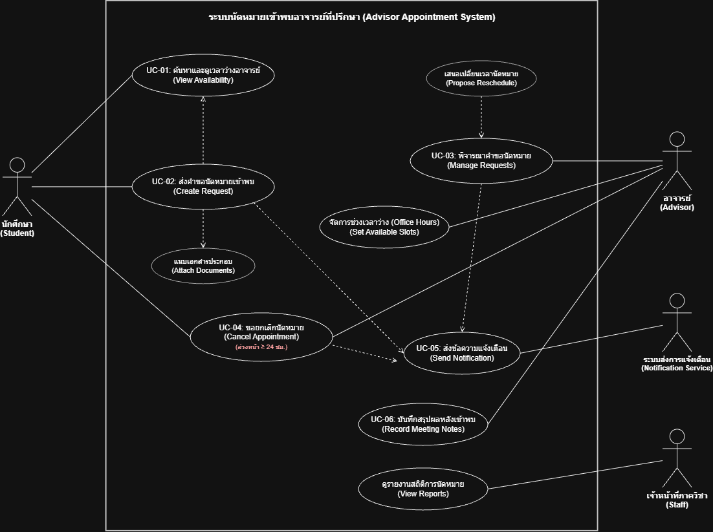
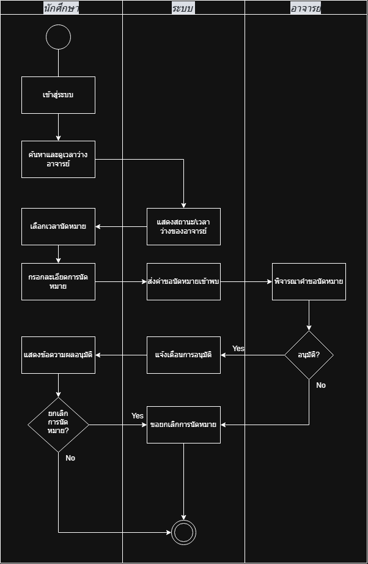

# 06 — Requirement Models: User Stories, Use Cases and Acceptance Criteria

> **Week 6 deliverable**  
> **Case:** ระบบนัดหมายอาจารย์ที่ปรึกษา (Advisor Appointment System)  
> **Source Backlog:** Week 05 Requirement Backlog (`FR-01..FR-06`, `BR-ADV-01`, `NFR-01..NFR-04`)

---

## 1. User Stories

| ID | User Story | Priority | Linked FR / BR | Acceptance Criteria |
|---|---|---|---|---|
| **US-01** | ในฐานะ**นักศึกษา** ฉันต้องการ**ดูตารางเวลาว่าง (Office Hours) และสถานะพร้อมให้เข้าพบของอาจารย์ที่ปรึกษา** เพื่อที่ฉันจะ**สามารถเลือกวันและเวลาที่อาจารย์สะดวกได้อย่างแม่นยำและไม่เสียเวลาเดินทางมาเก้อ** | Must | FR-01, NFR-03 | AC-01, AC-02 |
| **US-02** | ในฐานะ**นักศึกษา** ฉันต้องการ**ส่งคำขอนัดหมายโดยระบุวัตถุประสงค์ รายชื่อผู้เข้าพบ (เดี่ยว/กลุ่ม) และแนบไฟล์ประกอบ** เพื่อที่อาจารย์จะ**มีข้อมูลเพียงพอในการพิจารณาและเตรียมตัวล่วงหน้าก่อนการเข้าพบ** | Must | FR-02, FR-05 | AC-03, AC-04, AC-05 |
| **US-03** | ในฐานะ**อาจารย์ที่ปรึกษา** ฉันต้องการ**ตรวจสอบคำขอ และเลือกอนุมัติ ปฏิเสธ หรือขอเสนอเปลี่ยนวันเวลานัดหมายใหม่ (Reschedule)** เพื่อที่ฉันจะ**สามารถบริหารจัดการคิวและตารางภาระงานได้อย่างยืดหยุ่น** | Must | FR-03, FR-05 | AC-06, AC-07, AC-08 |
| **US-04** | ในฐานะ**นักศึกษาและอาจารย์ที่ปรึกษา** ฉันต้องการ**รับการแจ้งเตือนผ่าน Email สถาบัน และ Web Notification เมื่อมีการสร้างคำขอใหม่หรือมีการเปลี่ยนแปลงสถานะ** เพื่อที่ฉันจะ**ทราบความคืบหน้าของนัดหมายได้อย่างทันท่วงที** | Should | FR-04 | AC-09, AC-10 |
| **US-05** | ในฐานะ**ระบบ/ภาควิชา** ระบบต้อง**บังคับใช้กฎการยกเลิกหรือขอเลื่อนนัดหมายล่วงหน้าไม่น้อยกว่า 24 ชั่วโมง** เพื่อที่อาจารย์จะ**ไม่เสียเวลาทำงาน และเปิดโอกาสให้นักศึกษาคนอื่นสามารถจองเวลาแทนได้** | Must | BR-ADV-01, NFR-04 | AC-11, AC-12 |
| **US-06** | ในฐานะ**อาจารย์ที่ปรึกษา** ฉันต้องการ**บันทึกผลการเข้าพบหลังจากเสร็จสิ้นการให้คำปรึกษา** เพื่อที่ฉันและนักศึกษาจะ**มีประวัติและข้อสรุปในการติดตามความคืบหน้าของงาน** | Could | FR-06 | AC-13 |

---

## 2. Acceptance Criteria

### AC-01 — การแสดงผลตารางเวลาว่างของอาจารย์ (View Advisor Availability)
- **Given** นักศึกษาได้เข้าสู่ระบบและเลือกอาจารย์ที่ปรึกษาที่ต้องการเข้าพบ
- **When** นักศึกษาเปิดหน้าปฏิทินตารางเวลาของอาจารย์
- **Then** ระบบต้องแสดงช่วงเวลา Office Hours ที่ยังว่าง และทำเครื่องหมายช่วงเวลาที่ไม่ว่าง/ถูกจองแล้วอย่างชัดเจน โดยโหลดข้อมูลเสร็จสิ้นภายใน 3 วินาที

### AC-02 — การป้องกันการเลือกช่วงเวลาในอดีตหรือทับซ้อน (Slot Selection Validation)
- **Given** นักศึกษากำลังเลือกวันและเวลาในตารางนัดหมาย
- **When** นักศึกษาเลือกช่วงวันเวลาที่เป็นอดีต หรือช่วงเวลาที่ถูกจองไปแล้ว
- **Then** ระบบต้องไม่อนุญาตให้เลือกช่วงเวลานั้น และแสดงข้อความแจ้งเตือนว่า "ไม่สามารถเลือกช่วงเวลาดังกล่าวได้"

### AC-03 — การส่งคำขอนัดหมายพร้อมข้อมูลครบถ้วน (Submit Appointment Request)
- **Given** นักศึกษาเลือกช่วงเวลาว่างที่ถูกต้อง และอยู่ในหน้าฟอร์มสร้างคำขอ
- **When** นักศึกษากรอกข้อมูล Required Fields ครบถ้วน (หัวข้อวัตถุประสงค์, รายชื่อผู้เข้าพบ, รูปแบบ On-site/Online) และกดส่งคำขอ
- **Then** ระบบต้องบันทึกคำขอนัดหมายในสถานะ "Pending" และสร้างบันทึกคำขอเข้าสู่รายการรอพิจารณาของอาจารย์

### AC-04 — การแนบไฟล์ประกอบการนัดหมาย (File Attachment Validation)
- **Given** นักศึกษาต้องการแนบเอกสารโครงงานในฟอร์มนัดหมาย
- **When** นักศึกษาอัปโหลดไฟล์นามสกุล `.pdf` หรือ `.docx` ขนาดไม่เกิน 10MB
- **Then** ระบบต้องยอมรับไฟล์และแสดงชื่อไฟล์แนบในคำขอ แต่หากไฟล์เกิน 10MB หรือนามสกุลไม่ถูกต้อง ระบบต้องปฏิเสธไฟล์พร้อมแจ้งเตือนข้อผิดพลาด

### AC-05 — การเลือกรูปแบบการเข้าพบแบบ Online (Online Meeting Request)
- **Given** นักศึกษาระบุความประสงค์ขอเข้าพบแบบ "Online"
- **When** คำขอถูกส่งไปยังอาจารย์
- **Then** ระบบต้องแสดงสถานะคำขอว่าเป็นนัดหมายออนไลน์ เพื่อให้อาจารย์ระบุลิงก์การประชุม (เช่น Google Meet/MS Teams) ในขั้นตอนการอนุมัติ

### AC-06 — อาจารย์อนุมัติคำขอนัดหมาย (Advisor Approves Request)
- **Given** อาจารย์ที่ปรึกษาเปิดดูคำขอนัดหมายที่มีสถานะเป็น "Pending"
- **When** อาจารย์กดปุ่ม "อนุมัติ (Approve)" (และกรอกสถานที่ห้องพัก หรือแนบลิงก์กรณีเป็น Online)
- **Then** สถานะของคำขอต้องเปลี่ยนเป็น "Confirmed" และช่วงเวลาดังกล่าวจะถูกล็อกไม่ให้มีผู้อื่นจองซ้ำ

### AC-07 — อาจารย์ปฏิเสธคำขอนัดหมาย (Advisor Rejects Request)
- **Given** อาจารย์ที่ปรึกษาเปิดดูคำขอนัดหมายสถานะ "Pending"
- **When** อาจารย์กดปุ่ม "ปฏิเสธ (Reject)" และระบุเหตุผลประกอบการปฏิเสธ
- **Then** สถานะของคำขอต้องเปลี่ยนเป็น "Rejected" พร้อมบันทึกเหตุผล และปล่อยช่วงเวลาดังกล่าวกลับมาเป็นสถานะ "ว่าง"

### AC-08 — อาจารย์เสนอเลื่อนวันและเวลาใหม่ (Advisor Proposes Reschedule)
- **Given** อาจารย์ติดภารกิจด่วนในช่วงเวลาที่นักศึกษาขอเข้าพบ
- **When** อาจารย์เลือกคำขอแล้วกด "เสนอเลื่อนเวลา (Reschedule)" พร้อมเลือกวันเวลาว่างใหม่และระบุเหตุผล
- **Then** สถานะคำขอต้องเปลี่ยนเป็น "Rescheduled" และส่งคำขอนี้กลับไปให้นักศึกษายืนยันเวลาใหม่

### AC-09 — การแจ้งเตือนเมื่อคำขอเปลี่ยนสถานะ (Status Notification)
- **Given** คำขอนัดหมายมีการเปลี่ยนสถานะเป็น Confirmed, Rejected หรือ Rescheduled
- **When** การเปลี่ยนสถานะเสร็จสมบูรณ์ในระบบ
- **Then** ระบบต้องส่ง Email แจ้งเตือนไปยังอีเมลสถาบันของนักศึกษา และแสดงข้อความแจ้งเตือนผ่าน Web Notification ภายใน 1 นาที

### AC-10 — การแจ้งเตือนอาจารย์เมื่อมีคำขอใหม่ (New Request Notification)
- **Given** นักศึกษากดส่งคำขอนัดหมายสำเร็จ
- **When** บันทึกคำขอเข้าสู่ระบบ
- **Then** ระบบต้องส่ง Web Notification และ Email แจ้งเตือนไปยังอาจารย์ที่ปรึกษาที่เกี่ยวข้อง

### AC-11 — กฎการยกเลิกนัดหมายล่วงหน้ามากกว่า 24 ชั่วโมง (Cancellation > 24 Hours)
- **Given** นักศึกษามีนัดหมายสถานะ "Confirmed" ที่เหลือเวลามากกว่า 24 ชั่วโมงก่อนถึงเวลานัด
- **When** นักศึกษากด "ขอยกเลิกนัดหมาย" พร้อมระบุเหตุผล
- **Then** ระบบต้องอนุญาตให้ยกเลิก เปลี่ยนสถานะเป็น "Cancelled" ปลดล็อกช่วงเวลานั้นให้ว่าง และส่งแจ้งเตือนให้อาจารย์ทราบ

### AC-12 — กฎการปฏิเสธการยกเลิกนัดหมายกระชั้นชิด (Late Cancellation Block < 24 Hours)
- **Given** นักศึกษามีนัดหมายสถานะ "Confirmed" ที่เหลือเวลาน้อยกว่า 24 ชั่วโมงก่อนถึงเวลานัด
- **When** นักศึกษาพยายามกดยกเลิกนัดหมายผ่านหน้าเว็บ
- **Then** ระบบต้องปิดกั้น (Disabled) ปุ่มยกเลิก และแสดงข้อความแจ้งเตือนว่า "ไม่สามารถยกเลิกได้เนื่องจากเหลือน้อยกว่า 24 ชั่วโมง กรุณาติดต่ออาจารย์โดยตรง"

### AC-13 — การบันทึกสรุปผลหลังการเข้าพบ (Post-meeting Notes)
- **Given** นัดหมายสถานะ "Confirmed" ได้ผ่านพ้นช่วงวันและเวลาที่นัดแล้ว
- **When** อาจารย์ที่ปรึกษากรอกข้อความสรุปผลการเข้าพบและกดบันทึก
- **Then** สถานะนัดหมายต้องเปลี่ยนเป็น "Completed" และทั้งอาจารย์กับนักศึกษาสามารถเปิดดูบันทึกสรุปย้อนหลังได้

---

## 3. Use Case List

| ID | Use Case | Primary Actor | Goal | Related FR / BR | Diagram |
|---|---|---|---|---|---|
| **UC-01** | ตรวจสอบตารางเวลาว่างของอาจารย์ (View Advisor Availability) | นักศึกษา | ทราบช่วงเวลา Office Hours ที่แน่นอนของอาจารย์ | FR-01, NFR-03 | `../diagrams/use-case/uc01-view-availability.png` |
| **UC-02** | ส่งคำขอนัดหมายเข้าพบ (Create Appointment Request) | นักศึกษา | จองช่วงเวลาพร้อมระบุเหตุผลและเอกสารประกอบ | FR-02, FR-05 | `../diagrams/use-case/uc02-create-request.png` |
| **UC-03** | พิจารณาคำขอนัดหมาย (Manage Appointment Requests) | อาจารย์ที่ปรึกษา | อนุมัติ ปฏิเสธ หรือขอเสนอเลื่อนเวลานัดหมาย | FR-03, FR-05 | `../diagrams/use-case/uc03-manage-request.png` |
| **UC-04** | ยกเลิกนัดหมาย (Cancel Appointment) | นักศึกษา / อาจารย์ | ขอยกเลิกการนัดหมายตามเงื่อนไขเวลาที่กำหนด | BR-ADV-01, NFR-04 | `../diagrams/use-case/uc04-cancel-appointment.png` |
| **UC-05** | ส่งการแจ้งเตือน (Send Notification) | ระบบ (System Process) | แจ้งผู้ใช้เมื่อมีคำขอใหม่หรือสถานะคำขอเปลี่ยนแปลง | FR-04 | `../diagrams/use-case/uc05-send-notification.png` |
| **UC-06** | บันทึกสรุปผลการเข้าพบ (Record Meeting Notes) | อาจารย์ที่ปรึกษา | บันทึกประวัติและข้อสรุปการให้คำปรึกษา | FR-06 | `../diagrams/use-case/uc06-record-notes.png` |

---

## 4. Use Case Specification

### UC-02 — ส่งคำขอนัดหมายเข้าพบ (Create Appointment Request)

| Field | Detail |
|---|---|
| **Primary Actor** | นักศึกษา (Student) |
| **Trigger** | นักศึกษาต้องการนัดหมายอาจารย์ที่ปรึกษาเพื่อขอคำปรึกษา |
| **Preconditions** | 1. นักศึกษายืนยันตัวตนผ่านบัญชีสถาบันสำเร็จ 2. อาจารย์ที่ปรึกษาได้กำหนดช่วงเวลาว่าง (Office Hours) ไว้ในระบบ |
| **Main Success Scenario** | 1. นักศึกษาค้นหาและเลือกอาจารย์ที่ปรึกษา 2. ระบบแสดงปฏิทินช่วงเวลาว่างของอาจารย์ (Include UC-01) 3. นักศึกษาเลือกช่วงเวลาว่างที่ต้องการ 4. นักศึกษาระบุวัตถุประสงค์ (เช่น ปรึกษาโครงงาน, ลงทะเบียนเรียน) 5. นักศึกษาระบุรูปแบบการเข้าพบ (On-site หรือ Online) 6. นักศึกษาระบุรายชื่อผู้เข้าพบ (กรณีเข้าพบเป็นกลุ่ม) 7. นักศึกษาอัปโหลดไฟล์เอกสารประกอบ (ถ้ามี) 8. นักศึกษาตรวจสอบข้อมูลและกดยืนยันการส่งคำขอ 9. ระบบบันทึกคำขอในสถานะ "Pending" และส่งสัญญาณแจ้งเตือนไปยังอาจารย์ (Include UC-05) 10. ระบบแสดงข้อความยืนยันการส่งคำขอสำเร็จให้นักศึกษาทราบ |
| **Alternate / Exception Flows** | **4a. ข้อมูล Required Fields ไม่ครบถ้วน:** 1. ระบบแสดงข้อความแจ้งเตือนสีแดงใต้ช่องที่ยังไม่ได้กรอก 2. นักศึกษากรอกข้อมูลเพิ่มเติมให้ครบถ้วนก่อนส่งอีกครั้ง  **7a. ไฟล์แนบมีขนาดเกิน 10MB หรือนามสกุลไม่ถูกต้อง:** 1. ระบบไม่อนุญาตให้อัปโหลดและแจ้งเตือน "รองรับเฉพาะ .pdf, .docx ขนาดไม่เกิน 10MB" 2. นักศึกษาอัปโหลดไฟล์ใหม่ที่ถูกต้อง  **8a. ช่วงเวลาที่เลือกถูกผู้อื่นจองตัดหน้าในขณะกรอกฟอร์ม:** 1. ระบบแจ้งเตือน "ช่วงเวลาดังกล่าวถูกจองแล้ว กรุณาเลือกช่วงเวลาใหม่" 2. ระบบนำนักศึกษากลับไปเลือกช่วงเวลาในหน้าปฏิทินอีกครั้ง |
| **Postconditions** | คำขอนัดหมายถูกสร้างขึ้นในสถานะ "Pending" ตารางเวลาแสดงผลเป็น "รอการอนุมัติ" และอาจารย์ได้รับแจ้งเตือน |
| **Related Requirements** | FR-01, FR-02, FR-04, FR-05, NFR-01, NFR-02 |

---

### UC-03 — พิจารณาคำขอนัดหมาย (Manage Appointment Requests)

| Field | Detail |
|---|---|
| **Primary Actor** | อาจารย์ที่ปรึกษา (Advisor) |
| **Trigger** | มีคำขอนัดหมายสถานะ "Pending" ค้างอยู่ในระบบ หรืออาจารย์เข้ามาจัดการตารางเวลา |
| **Preconditions** | อาจารย์ยืนยันตัวตนผ่านบัญชีสถาบัน และมีคำขอนัดหมายค้างการพิจารณา |
| **Main Success Scenario (Approve)** | 1. อาจารย์เปิดหน้ารายการคำขอนัดหมาย 2. ระบบแสดงรายการคำขอทั้งหมดพร้อมวัตถุประสงค์และไฟล์แนบ 3. อาจารย์เลือกคำขอนัดหมายที่ต้องการพิจารณา 4. อาจารย์เลือกตัวเลือก "อนุมัติ (Approve)" 5. กรณีคำขอเป็น Online อาจารย์ระบุลิงก์การประชุม (เช่น Google Meet) 6. อาจารย์กดยืนยันการอนุมัติ 7. ระบบเปลี่ยนสถานะคำขอเป็น "Confirmed" 8. ระบบล็อกช่วงเวลานั้นในปฏิทิน และส่งการแจ้งเตือนไปยังนักศึกษา (Include UC-05) |
| **Alternate / Exception Flows** | **4a. อาจารย์ต้องการปฏิเสธคำขอ (Reject):** 1. อาจารย์เลือกตัวเลือก "ปฏิเสธ (Reject)" 2. ระบบบังคับให้อาจารย์กรอกเหตุผลในการปฏิเสธ 3. อาจารย์กดยืนยัน ระบบเปลี่ยนสถานะเป็น "Rejected" ปลดล็อกช่วงเวลากลับเป็นว่าง และแจ้งเตือนนักศึกษา  **4b. อาจารย์ติดภารกิจและต้องการเสนอเลื่อนเวลา (Reschedule):** 1. อาจารย์เลือกตัวเลือก "เสนอเลื่อนเวลา (Reschedule)" 2. อาจารย์เลือกช่วงวันเวลาว่างใหม่ และระบุเหตุผลในการขอเลื่อน 3. อาจารย์กดยืนยัน ระบบเปลี่ยนสถานะเป็น "Rescheduled" และแจ้งเตือนให้นักศึกษาพิจารณาเวลาใหม่ |
| **Postconditions** | สถานะคำขอนัดหมายเปลี่ยนเป็น "Confirmed", "Rejected" หรือ "Rescheduled" และข้อมูลในปฏิทินอัปเดตสอดคล้องกัน |
| **Related Requirements** | FR-03, FR-04, FR-05, NFR-01 |

---

### UC-04 — ยกเลิกนัดหมาย (Cancel Appointment)

| Field | Detail |
|---|---|
| **Primary Actor** | นักศึกษา (Student) หรือ อาจารย์ที่ปรึกษา (Advisor) |
| **Trigger** | ผู้ใช้ติดภารกิจจำเป็นและไม่สามารถเข้าพบตามนัดหมายที่ยืนยันแล้วได้ |
| **Preconditions** | คำขอนัดหมายอยู่ในสถานะ "Confirmed" |
| **Main Success Scenario** | 1. นักศึกษาเปิดหน้ารายละเอียดการนัดหมายของตนเอง 2. ระบบตรวจสอบว่าเวลาปัจจุบันห่างจากเวลานัดหมายมากกว่า 24 ชั่วโมง (Check BR-ADV-01) 3. นักศึกษากดปุ่ม "ขอยกเลิกนัดหมาย" 4. ระบบแสดงหน้าต่างยืนยันพร้อมช่องให้ระบุเหตุผลการยกเลิก 5. นักศึกษากรอกเหตุผลและกดยืนยัน 6. ระบบเปลี่ยนสถานะนัดหมายเป็น "Cancelled" 7. ระบบปลดล็อกช่วงเวลาในตารางให้กลับมาว่าง และส่ง Email/Web Alert ให้อาจารย์ทราบ (Include UC-05) |
| **Alternate / Exception Flows** | **2a. นักศึกษาพยายามกดยกเลิกเมื่อเหลือน้อยกว่า 24 ชั่วโมง:** 1. ระบบปิดกั้นปุ่มยกเลิก (Disabled) 2. ระบบแสดงข้อความแจ้งเตือนเงื่อนไข: "ไม่สามารถยกเลิกผ่านระบบได้เนื่องจากเหลือน้อยกว่า 24 ชั่วโมง กรุณาติดต่ออาจารย์ที่ปรึกษาโดยตรง" 3. Workflow สิ้นสุดโดยไม่มีการเปลี่ยนสถานะ  **1b. อาจารย์เป็นผู้ขอยกเลิกนัดหมายกระทันหัน:** 1. อาจารย์สามารถกดยกเลิกได้ตลอดเวลาเมื่อติดภารกิจด่วนของคณะ 2. ระบบบังคับให้อาจารย์ระบุเหตุผลฉุกเฉิน และส่งแจ้งเตือนด่วนไปยังนักศึกษาทันที |
| **Postconditions** | คำขอนัดหมายเปลี่ยนสถานะเป็น "Cancelled" ตารางเวลาว่างถูกคืนสิทธิ์ และมีการบันทึก Audit Trail ของการยกเลิก |
| **Related Requirements** | BR-ADV-01, FR-04, NFR-01, NFR-04 |

---

## 5. Requirement Models / Diagrams

- Use Case Diagram:   
  *(แสดง Actors: นักศึกษา, อาจารย์ที่ปรึกษา, เจ้าหน้าที่ภาควิชา, ระบบแจ้งเตือน พร้อมความสัมพันธ์ Include/Extend)*
- **Activity Diagram:**  
  *(แสดง Swimlane: นักศึกษา, อาจารย์ และระบบ ตั้งแต่ค้นหาเวลา ส่งคำขอ การตัดสินใจ 24 ชม. จนถึงแจ้งเตือนผล)*
- **Domain Model / ER Concept:** [`diagrams/domain-model/appointment-domain-model.png`](../diagrams/domain-model/appointment-domain-model.png)  
  *(แสดง Entity: User, AdvisorProfile, TimeSlot, AppointmentRequest, Attachment, Notification)*
  
---

## 6. Negotiation / Trade-off Notes

บันทึกสิ่งที่ไม่ได้เลือกหรือเลื่อนออกจาก scope พร้อมเหตุผลเชิงวิศวกรรมความต้องการ (Traceable to Week 04 & 05):

1. **การเชื่อมต่อ Google Calendar แบบ Two-way Sync (`ISSUE-ADV-01` / `C-03`):**
   * *สิ่งที่ตัดสินใจ:* ใช้ระบบปฏิทินจำลองภายในเว็บไซต์เท่านั้น ไม่ทำ Sync อัตโนมัติกับบัญชี Google ภายนอก
   * *เหตุผล:* ป้องกันความเสี่ยงด้าน Data Privacy และข้อจำกัดนโยบายความปลอดภัยของ IT Admin สถาบัน
2. **การส่งแจ้งเตือนผ่าน LINE Notify / LINE OA (`ISSUE-ADV-02` / `C-02`):**
   * *สิ่งที่ตัดสินใจ:* ใช้การแจ้งเตือนผ่าน Web Notification + Email สถาบันเท่านั้น
   * *เหตุผล:* LINE API ภายนอกมีความซับซ้อนและมีค่าใช้จ่าย ซึ่งเกินขอบเขต (Out of Scope) ของโครงงานรายวิชา
3. **การสร้างลิงก์การประชุม Zoom / MS Teams แบบอัตโนมัติ:**
   * *สิ่งที่ตัดสินใจ:* ให้อาจารย์เป็นผู้แนบลิงก์การประชุมแบบ Manual ในขั้นตอนอนุมัตินัดหมาย
   * *เหตุผล:* หลีกเลี่ยงความซับซ้อนของการผูก API สิทธิ์ระดับองค์กร โดยยังคงตอบโจทย์ความยืดหยุ่นของการเข้าพบแบบ Online ได้
4. **กฎการลงโทษ No-show และระบบตัดสิทธิ์จองคิว (`ISSUE-ADV-03`):**
   * *สิ่งที่ตัดสินใจ:* ยังไม่สร้าง Business Rule การปรับหรือตัดสิทธิ์นักศึกษาในเฟสนี้
   * *เหตุผล:* ยังไม่มีประกาศนโยบายอย่างเป็นทางการจากภาควิชา จึงไม่สร้างกฎสมมติขึ้นเองโดยไม่มี Evidence รองรับ